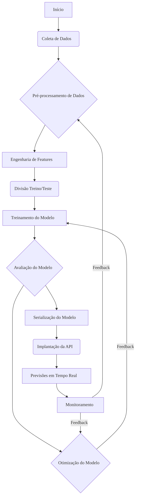
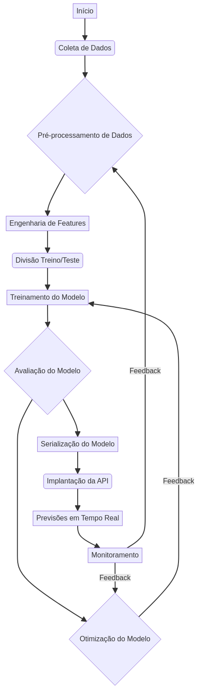
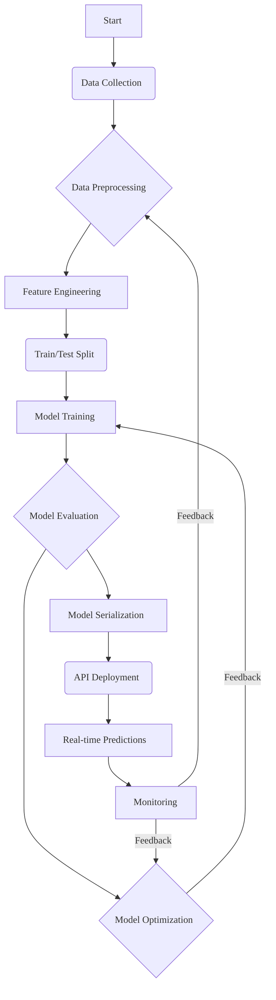

# Python ML Pipeline Completo


## 🎯 Visão Geral

Este repositório apresenta um **pipeline de Machine Learning (ML) completo e robusto** desenvolvido em Python. Ele abrange todas as etapas essenciais de um projeto de ML, desde a ingestão e pré-processamento de dados até o treinamento, avaliação, serialização de modelos e, finalmente, a disponibilização via API RESTful. O objetivo é fornecer uma estrutura modular e escalável para o desenvolvimento e implantação de soluções de ML.

### ✨ Características Principais:

*   **Modularidade**: Componentes bem definidos para cada etapa do pipeline (carregamento de dados, engenharia de features, treinamento, avaliação).
*   **Flexibilidade**: Suporte a diferentes modelos de ML (Regressão Logística, Random Forest, SVM) e fácil extensão para outros algoritmos.
*   **API RESTful**: Integração com FastAPI para servir previsões em tempo real.
*   **Testes Abrangentes**: Testes unitários e de integração para garantir a robustez e correção do código.
*   **Configuração Externa**: Gerenciamento de configurações via arquivos YAML.
*   **Containerização**: Suporte a Docker para empacotamento e implantação facilitada.

## 🎯 Overview

This repository presents a **complete and robust Machine Learning (ML) pipeline** developed in Python. It covers all essential stages of an ML project, from data ingestion and preprocessing to model training, evaluation, serialization, and finally, deployment via a RESTful API. The goal is to provide a modular and scalable framework for developing and deploying ML solutions.

### ✨ Key Features:

*   **Modularity**: Well-defined components for each pipeline stage (data loading, feature engineering, training, evaluation).
*   **Flexibility**: Support for various ML models (Logistic Regression, Random Forest, SVM) and easy extension to other algorithms.
*   **RESTful API**: Integration with FastAPI for serving real-time predictions.
*   **Comprehensive Testing**: Unit and integration tests to ensure code robustness and correctness.
*   **External Configuration**: Configuration management via YAML files.
*   **Containerization**: Docker support for easy packaging and deployment.

## Sumário

1.  [Visão Geral](#visão-geral)
2.  [Estrutura do Projeto](#estrutura-do-projeto)
3.  [Instalação](#instalação)
4.  [Uso](#uso)
5.  [API](#api)
6.  [Testes](#testes)
7.  [Arquitetura](#arquitetura)
8.  [Contribuição](#contribuição)
9.  [Licença](#licença)

## Table of Contents

1.  [Overview](#overview)
2.  [Project Structure](#project-structure)
3.  [Installation](#installation)
4.  [Usage](#usage)
5.  [API](#api-1)
6.  [Testing](#testing)
7.  [Architecture](#architecture)
8.  [Contribution](#contribution)
9.  [License](#license-1)

## 📁 Estrutura do Projeto

```
python-ml-pipeline-complete/
├── config/                 # Arquivos de configuração
│   ├── config.yaml
│   └── model_config.yaml
├── data/                   # Dados do projeto
│   ├── raw/                # Dados brutos
│   ├── processed/          # Dados processados
│   └── features/           # Features engenheiradas
├── docs/                   # Documentação e diagramas
│   └── pipeline_architecture.mmd
│   └── pipeline_architecture.png
├── docker/                 # Arquivos Docker
│   ├── Dockerfile
│   └── docker-compose.yml
├── k8s/                    # Configurações Kubernetes
│   └── deployment.yaml
├── models/                 # Modelos treinados e serializados
├── notebooks/              # Notebooks de exploração e experimentação
├── reports/                # Relatórios de avaliação e análises
├── src/                    # Código fonte da aplicação
│   ├── api/                # Implementação da API FastAPI
│   │   └── main.py
│   ├── __init__.py
│   ├── app_dashboard.py    # Exemplo de dashboard (se aplicável)
│   ├── data_loader.py      # Módulo de carregamento de dados
│   ├── feature_engineering.py # Módulo de engenharia de features
│   ├── main.py             # Ponto de entrada do pipeline CLI
│   ├── model_evaluator.py  # Módulo de avaliação de modelos
│   ├── model_trainer.py    # Módulo de treinamento de modelos
│   ├── monitoring.py       # Módulo de monitoramento (se aplicável)
│   └── pipeline.py         # Orquestrador do pipeline ML
├── tests/                  # Testes unitários e de integração
│   ├── __init__.py
│   ├── conftest.py
│   ├── test_api.py
│   ├── test_integration.py
│   └── test_pipeline.py
├── .gitignore              # Arquivos e pastas a serem ignorados pelo Git
├── LICENSE                 # Arquivo de licença
├── README.md               # Este arquivo
└── requirements.txt        # Dependências do projeto
```

## 📁 Project Structure

```
python-ml-pipeline-complete/
├── config/                 # Configuration files
│   ├── config.yaml
│   └── model_config.yaml
├── data/                   # Project data
│   ├── raw/                # Raw data
│   ├── processed/          # Processed data
│   └── features/           # Engineered features
├── docs/                   # Documentation and diagrams
│   └── pipeline_architecture.mmd
│   └── pipeline_architecture.png
├── docker/                 # Docker files
│   ├── Dockerfile
│   └── docker-compose.yml
├── k8s/                    # Kubernetes configurations
│   └── deployment.yaml
├── models/                 # Trained and serialized models
├── notebooks/              # Exploration and experimentation notebooks
├── reports/                # Evaluation reports and analyses
├── src/                    # Application source code
│   ├── api/                # FastAPI API implementation
│   │   └── main.py
│   ├── __init__.py
│   ├── app_dashboard.py    # Example dashboard (if applicable)
│   ├── data_loader.py      # Data loading module
│   ├── feature_engineering.py # Feature engineering module
│   ├── main.py             # CLI pipeline entry point
│   ├── model_evaluator.py  # Model evaluation module
│   ├── model_trainer.py    # Model training module
│   ├── monitoring.py       # Monitoring module (if applicable)
│   └── pipeline.py         # ML pipeline orchestrator
├── tests/                  # Unit and integration tests
│   ├── __init__.py
│   ├── conftest.py
│   ├── test_api.py
│   ├── test_integration.py
│   └── test_pipeline.py
├── .gitignore              # Files and folders to be ignored by Git
├── LICENSE                 # License file
├── README.md               # This file
└── requirements.txt        # Project dependencies
```

## Instalação

Para configurar o ambiente de desenvolvimento e executar o pipeline, siga os passos abaixo:

1.  **Clone o repositório:**

    ```bash
    git clone https://github.com/GabrielDemetriosLafis/python-ml-pipeline-complete.git
    cd python-ml-pipeline-complete
    ```

2.  **Crie e ative um ambiente virtual (recomendado):**

    ```bash
    python -m venv venv
    source venv/bin/activate  # No Windows: .venv\Scripts\activate
    ```

3.  **Instale as dependências:**

    ```bash
    pip install -r requirements.txt
    ```

## Installation

To set up the development environment and run the pipeline, follow these steps:

1.  **Clone the repository:**

    ```bash
    git clone https://github.com/GabrielDemetriosLafis/python-ml-pipeline-complete.git
    cd python-ml-pipeline-complete
    ```

2.  **Create and activate a virtual environment (recommended):**

    ```bash
    python -m venv venv
    source venv/bin/activate  # On Windows: .venv\Scripts\activate
    ```

3.  **Install dependencies:**

    ```bash
    pip install -r requirements.txt
    ```

## Uso

O pipeline pode ser executado via linha de comando. Certifique-se de ter ativado seu ambiente virtual.

### Treinamento e Avaliação de Modelo:

Para treinar e avaliar um modelo, use o script `main.py`:

```bash
python -m src.main --data data/raw/dummy_data.csv --model logistic --output models/model.joblib --verbose
```

**Argumentos:**

*   `--data` ou `-d`: Caminho para o arquivo CSV de dados de entrada.
*   `--model` ou `-m`: Tipo de modelo a ser usado (`logistic`, `random_forest`, `svm`).
*   `--output` ou `-o`: Caminho para salvar o modelo treinado (padrão: `model.joblib`).
*   `--test-size`: Proporção dos dados para teste (padrão: `0.2`).
*   `--random-state`: Seed para reprodutibilidade (padrão: `42`).
*   `--verbose` ou `-v`: Ativa o modo verboso para informações detalhadas.

**Parâmetros Específicos do Modelo:**

*   `--max-iter` (LogisticRegression): Número máximo de iterações.
*   `--C` (LogisticRegression/SVM): Parâmetro de regularização.
*   `--n-estimators` (RandomForestClassifier): Número de árvores.
*   `--max-depth` (RandomForestClassifier): Profundidade máxima das árvores.
*   `--kernel` (SVM): Kernel do SVM (`linear`, `poly`, `rbf`, `sigmoid`).

## Usage

The pipeline can be executed via the command line. Make sure you have activated your virtual environment.

### Model Training and Evaluation:

To train and evaluate a model, use the `main.py` script:

```bash
python -m src.main --data data/raw/dummy_data.csv --model logistic --output models/model.joblib --verbose
```

**Arguments:**

*   `--data` or `-d`: Path to the input CSV data file.
*   `--model` or `-m`: Type of model to use (`logistic`, `random_forest`, `svm`).
*   `--output` or `-o`: Path to save the trained model (default: `model.joblib`).
*   `--test-size`: Proportion of data for testing (default: `0.2`).
*   `--random-state`: Seed for reproducibility (default: `42`).
*   `--verbose` or `-v`: Activates verbose mode for detailed information.

**Model-Specific Parameters:**

*   `--max-iter` (LogisticRegression): Maximum number of iterations.
*   `--C` (LogisticRegression/SVM): Regularization parameter.
*   `--n-estimators` (RandomForestClassifier): Number of trees.
*   `--max-depth` (RandomForestClassifier): Maximum tree depth.
*   `--kernel` (SVM): SVM kernel (`linear`, `poly`, `rbf`, `sigmoid`).

## API

A API RESTful é construída com FastAPI e permite servir previsões do modelo treinado. Para iniciar a API:

```bash
cd python-ml-pipeline-complete
uvicorn src.api.main:app --host 0.0.0.0 --port 8000 --reload
```

Após iniciar, a documentação interativa da API estará disponível em `http://localhost:8000/docs`.

### Endpoints:

*   **GET /**: Health check da API.
*   **GET /model/info**: Retorna informações sobre o modelo carregado.
*   **POST /predict**: Recebe dados e retorna previsões.
    *   **Request Body**: `{"data": [[feature1, feature2, ...]]}`
    *   **Response**: `{"prediction": [pred1, pred2, ...], "status": "success"}`
*   **POST /predict/batch**: Endpoint para predições em lote.
*   **POST /reload-model**: Recarrega o modelo do disco.

## API

 The RESTful API is built with FastAPI and allows serving predictions from the trained model. To start the API:

```bash
cd python-ml-pipeline-complete
uvicorn src.api.main:app --host 0.0.0.0 --port 8000 --reload
```

Once started, the interactive API documentation will be available at `http://localhost:8000/docs`.

### Endpoints:

*   **GET /**: API health check.
*   **GET /model/info**: Returns information about the loaded model.
*   **POST /predict**: Receives data and returns predictions.
    *   **Request Body**: `{"data": [[feature1, feature2, ...]]}`
    *   **Response**: `{"prediction": [pred1, pred2, ...], "status": "success"}`
*   **POST /predict/batch**: Endpoint for batch predictions.
*   **POST /reload-model**: Reloads the model from disk.

## Testes

Os testes unitários e de integração garantem a qualidade e a funcionalidade do pipeline. Para executá-los:

```bash
cd python-ml-pipeline-complete
pytest
```

## Testing

Unit and integration tests ensure the quality and functionality of the pipeline. To run them:

```bash
cd python-ml-pipeline-complete
pytest
```

## Arquitetura

O diagrama abaixo ilustra a arquitetura do pipeline de Machine Learning, destacando o fluxo de dados e as interações entre os componentes.





## Architecture

The diagram below illustrates the architecture of the Machine Learning pipeline, highlighting the data flow and interactions between components.




## Contribuição

Contribuições são bem-vindas! Siga estas diretrizes:

1.  Faça um fork do repositório.
2.  Crie uma nova branch (`git checkout -b feature/sua-feature`).
3.  Implemente suas mudanças e escreva testes adequados.
4.  Certifique-se de que todos os testes passem.
5.  Faça commit de suas mudanças (`git commit -m 'Adiciona nova feature'`).
6.  Envie para a branch (`git push origin feature/sua-feature`).
7.  Abra um Pull Request.

## Contribution

Contributions are welcome! Please follow these guidelines:

1.  Fork the repository.
2.  Create a new branch (`git checkout -b feature/your-feature`).
3.  Implement your changes and write appropriate tests.
4.  Ensure all tests pass.
5.  Commit your changes (`git commit -m 'Add new feature'`).
6.  Push to the branch (`git push origin feature/your-feature`).
7.  Open a Pull Request.

## Licença

Este projeto está licenciado sob a Licença MIT. Veja o arquivo [LICENSE](LICENSE) para mais detalhes.

## License

This project is licensed under the MIT License. See the [LICENSE](LICENSE) file for more details.

---

**Autor:** Gabriel Demetrios Lafis

---

**Author:** Gabriel Demetrios Lafis

